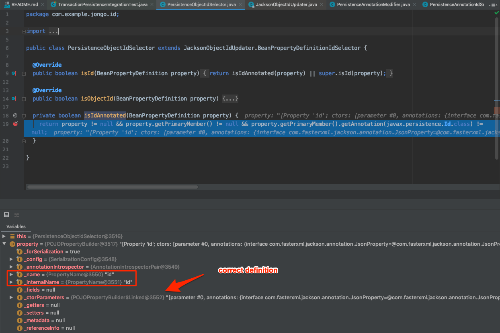
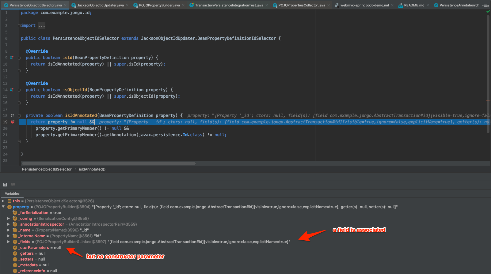
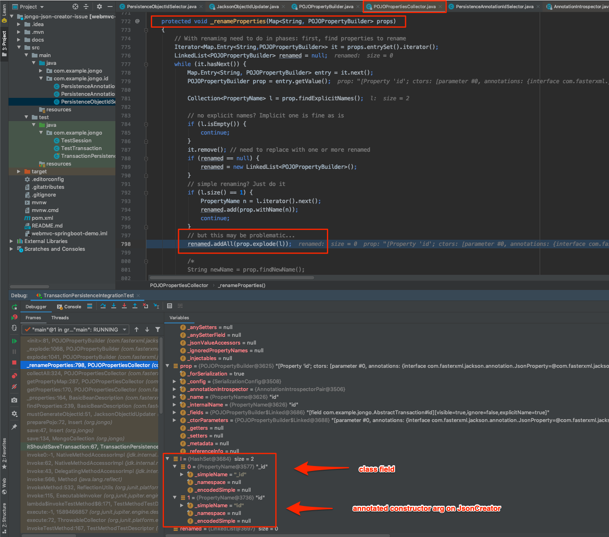

# Jongo with @JsonCreator Parameters Issue

I am using the [Java Persistence Annotation](https://github.com/bguerout/jongo-extras/tree/master/javax-persistence) to mark a String id field. Combining this with `@JsonCreator` annotation leads to following error:

```
Caused by: com.fasterxml.jackson.databind.exc.MismatchedInputException: Missing required creator property 'id' (index 0)
 at [Source: de.undercouch.bson4jackson.io.LittleEndianInputStream@51745f40; pos: 54]
	at com.fasterxml.jackson.databind.exc.MismatchedInputException.from(MismatchedInputException.java:59)
	at com.fasterxml.jackson.databind.DeserializationContext.reportInputMismatch(DeserializationContext.java:1317)
	at com.fasterxml.jackson.databind.deser.impl.PropertyValueBuffer._findMissing(PropertyValueBuffer.java:193)
	at com.fasterxml.jackson.databind.deser.impl.PropertyValueBuffer.getParameters(PropertyValueBuffer.java:159)
	at com.fasterxml.jackson.databind.deser.ValueInstantiator.createFromObjectWith(ValueInstantiator.java:229)
	at com.fasterxml.jackson.databind.deser.impl.PropertyBasedCreator.build(PropertyBasedCreator.java:195)
	at com.fasterxml.jackson.databind.deser.BeanDeserializer._deserializeUsingPropertyBased(BeanDeserializer.java:488)
	at com.fasterxml.jackson.databind.deser.BeanDeserializerBase.deserializeFromObjectUsingNonDefault(BeanDeserializerBase.java:1287)
	at com.fasterxml.jackson.databind.deser.BeanDeserializer.deserializeFromObject(BeanDeserializer.java:326)
	at com.fasterxml.jackson.databind.deser.BeanDeserializer.deserialize(BeanDeserializer.java:159)
	at com.fasterxml.jackson.databind.ObjectReader._bindAndClose(ObjectReader.java:1611)
	at com.fasterxml.jackson.databind.ObjectReader.readValue(ObjectReader.java:1250)
	at org.jongo.marshall.jackson.JacksonEngine.unmarshall(JacksonEngine.java:51)
	... 43 more
```

When I look at the `BeanPropertyDefinition`s running through `com.example.jongo.id.PersistenceObjectIdSelector#isIdAnnotated(BeanPropertyDefinition)` I can see that initially the definition for the `id` constructor arg is supplied. The call `property.getPrimaryMember()` yields `null` which I assume means that this definition has not yet been linked to a field.



The 2nd id related property running through is linked to an annotated id field but not a constructor arg.



Both the creator constructor property and the class property have the same internal name "`id`".

There seems to be an issue with "merging" the creator field with the class property that may have to do with the name of the constructor arg. In `com.fasterxml.jackson.databind.introspect.POJOPropertiesCollector#_renameProperties()` we can see that the 2 fields that it tries to "merge" have different names and along the way somehow the constructor definition is not copied to the field definition.



End result is that Jackson does not know which constructor parameter to deserialise the `_id` property into.

Setting the mode to `JsonCreator.Mode.PROPERTIES` on the annotated [TestTransaction class](src/test/java/com/example/jongo/TestTransaction.java) will not make any difference the the property merge failure.

Also inspected the `com.fasterxml.jackson.databind.introspect.POJOPropertiesCollector#getPropertyMap()` result and it is clear that Jackson loses the constructor parameter definition in the process.
